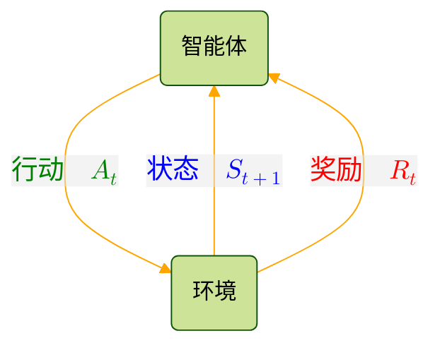

<!-- markdownlint-disable MD001 MD036 -->

# ゼロから作るDeep Learning ❹-強化学習編

斎藤康毅 Koki Saitoh @SaitohKoki

Deep Learning from Scratch ❹-Reinforcement Learning

深度学习入门4 译者: 郑明智 出版年: 2024-8-13

<https://github.com/oreilly-japan/deep-learning-from-scratch-4>

Colab | Kaggle | Studio Lab

<https://colab.research.google.com/github/oreilly-japan/deep-learning-from-scratch-4/blob/master/notebooks/01_bandit.ipynb>

----

- 监督学习：使用带有输入和输出（正确答案标签）的成对数据，学习如何将输入转化为输出。
- 无监督学习：使用没有“正确答案标签”的数据来学习数据中的基本结构。
- 强化学习：学习如何使用智能体在与环境互动时收集的数据获得更高的奖励。

环境内部拥有**状态**(state)；当<u>智能体</u>采取某些行动时，<u>环境</u>的状态会发生变化，智能体会根据状态采取适当的行动

- **奖励**(Reward) $R$
- **行动**(Action) $A$
- **行动价值**(action value) Quality $Q$ 或 $q$
- 期望值 Expectation $\mathbb{E}[A]$
- 采取某个行动所得到的奖励 $q(A)=\mathbb{E}[R|A=a]$

$\epsilon$-greedy算法

- 利用(exploitation) 贪婪行动 玩家将根据以前的经验选择最佳行动。

- 探索(exploration) 非贪婪行动 玩家可以对每台老虎机的价值做出更准确的估计。

#### MDP

马尔可夫决策过程(MDP, Markov Decision Proces)

- 状态迁移：状态如何迁移。
  - $f(s,a)$  状态迁移函数(state transition function)
  - $p(s'|s,a)$ 状态迁移概率(state transition probability)
- 奖励：如何给予奖励。
  - $r(s,a,s')$ 奖励函数(reward function）

- 策略：智能体如何决定行动。
  - $\pi(a|s)$ 策略(policy) 表示在状态*s*下采取行动*a*的概率

MDP的**目标**是找到最优策略(optimal policy)

- **收益(return)** 智能体的目标是使**收益**最大化
- 收益的期望值 **状态价值函数**(state-value function) $v_\pi(s) = \mathbb{E}_\pi [G_t | S_t = s,\pi]$

- **行动价值函数**(action-value function) $q_\pi(s,a) = \mathbb{E}_\pi [G_t | S_t = s, A_t = a]$

#### 贝尔曼方程

**贝尔曼方程(Bellman Equation)** 状态价值
$$
\begin{align*}
v_\pi(s) &= \mathbb{E}_\pi [R_t | S_t = s] + \gamma \mathbb{E}_\pi [G_{t+1} | S_t = s] \\
&= \sum_{a, s'} \pi(a|s) p(s' | s,a) r(s,a,s') + \gamma \sum_{a, s'} \pi(a|s) p(s' | s,a) v_\pi(s') \\
&= \sum_{a, s'} \pi(a|s) p(s' | s,a) \left\{ r(s,a,s') + \gamma v_\pi(s') \right\}
\end{align*}
$$

**Q函数的贝尔曼方程** 行动价值
$$
\begin{align*}
q_\pi(s, a) &= \mathbb{E}_\pi[R_t + \gamma G_{t+1} \mid S_t = s, A_t = a] \\
&= \mathbb{E}_\pi[R_t \mid S_t = s, A_t = a] + \gamma \mathbb{E}_\pi[G_{t+1} \mid S_t = s, A_t = a] \\
&= \sum_{s'} p(s' \mid s, a) r(s, a, s') + \gamma \sum_{s'} p(s' \mid s, a) \mathbb{E}_\pi[G_{t+1} \mid S_{t+1} = s'] \\
&= \sum_{s'} p(s' \mid s, a) \{r(s, a, s') + \gamma \mathbb{E}_\pi[G_{t+1} \mid S_{t+1} = s']\} \\
&= \sum_{s'} p(s' \mid s, a) \{r(s, a, s') + \gamma v_\pi(s')\} \\
&= \sum_{s'} p(s' \mid s, a) \left\{ r(s, a, s') + \gamma \sum_{a'} \pi(a' \mid s') q_\pi(s', a') \right\}
\end{align*}
$$

**贝尔曼最优方程(Bellman optimality equation)**
$$
\begin{align*}
v_\pi(s) &= \sum_{a, s'} \pi(a|s) p(s' | s,a) \left\{ r(s,a,s') + \gamma v_\pi(s') \right\} \\
&= \sum_a \pi(a|s) \sum_{s'} p(s'|s,a) \left\{ r(s,a,s') + \gamma v_\pi(s') \right\}
\end{align*}
$$
$$
\begin{align*}
v_*(s) = \sum_a \pi_*(a \mid s) \sum_{s'} p(s' \mid s, a) \left\{ r(s, a, s') + \gamma v_*(s') \right\}
\end{align*}
$$
$$
\begin{align*}
v_*(s) = \max_a \sum_{s'} p(s'|s, a) \{r(s, a, s') + \gamma v_*(s')\}
\end{align*}
$$

**Q函数的贝尔曼最优方程**
$$
\begin{align*}
q_\pi(s, a) &= \sum_{s'} p(s'|s, a) \left\{ r(s, a, s') + \gamma \sum_{a'} \pi(a'|s') q_\pi(s', a') \right\} \\

q_*(s, a) &= \sum_{s'} p(s'|s, a) \left\{ r(s, a, s') + \gamma \sum_{a'} \pi^*(a'|s') q_*(s', a') \right\} \\
&= \sum_{s'} p(s'|s, a) \left\{ r(s, a, s') + \gamma \max_{a'} q_*(s', a') \right\}
\end{align*}
$$

#### 最优策略

$$
\mu_*(s) = \arg\!\max_a q_*(s, a)
$$

$$
\mu_{*}(s) = \arg\max_a \sum_{s'} p(s'|s,a)\{r(s,a,s')+ \gamma v_{*}(s')\}
$$

#### DP

策略迭代法在评估和改进这两个阶段之间交替重复进行。

在评估阶段，使用DP对价值函数进行评估。在评估完价值函数后，就可以通过对价值函数贪婪化来改进策略。如果不能改进，那么说明这个策略就是最优策略。

**贪婪的策略**指的是在局部的候选者中寻求最优行动。拿现在的例子来说，贝尔曼最优方程只与当前状态($s$)和下一个状态($s'$)相关，只需考虑下一个状态就能选择价值最大的行动。

#### MC

- 分布模型(distribution model)
- 样本模型(sample model)

**重要性采样(importance sampling)** 从行为策略获得的样本数据来求目标策略的期望值 —— 利用从其他概率分布中采样的数据来计算某个概率分布的期望值

从作用的角度来看
- 目标策略(target policy) 作为评估和改进对象的策略。
- 行为策略(behaviour policy) 智能体实际用来采取行动的策略。

智能体可以基于行为策略实际采取行动，并利用获得的经验来更新目标策略。

- **同策略型(on-policy)** ：目标策略和行为策略相同 基于自己的经验改进自己的策略的做法
- **异策略型(off-policy)** ：目标策略和行为策略不同 基于从其他地方获得的经验改进了自己的策略

#### TD

|方法||描述|公式|
|:--|:--|:--|:--|
|DP|动态规划(Dynamic Programming)|通过“自举”的方式就能依次更新价值函数|$V'_{\pi}(s) = \sum\limits_{a, s'} \pi(a \mid s) p(s' \mid s, a) \{ r(s, a, s') + \gamma V_{\pi}(s') \}$|
|MC|蒙特卡洛方法(Monte Carlo method)|无须了解环境相关的知识，使用采样数据就能对价值函数进行更新|$V'_{\pi}(S_t) = V_{\pi}(S_t) + \alpha \left\{ \textcolor{red}{G\_t} - V_{\pi}(S_t) \right\}$|
|TD|时间差分(Temporal Difference)|只使用下一个行动和价值函数来更新当前的价值函数|$V'_{\pi}(S_t) = V{\pi}(S_t) + \alpha \left\{\textcolor{red} {R_t + \gamma V_{\pi}(S_{t+1})} - V_{\pi}(S_t) \right\}$|

贝尔曼方程 -> **SARSA** 来源于TD方法中使用的数据($S_t,A_t,R_t,S_{t+1},A_{t+1}$)的首字母。

贝尔曼最优方程 -> **Q学习(Q-leaming)**有以下3个特点

- 采用TD方法
- 是异策略型
- 不使用重要性采样

#### 策略梯度法

Q学习、SARSA、蒙特卡洛方法等算法。这些算法大致可以被归类为**基于价值的方法(value-based method)**。这里所说的“价值”是指行动价值函数(Q函数)和状态价值函数。基于价值的方法会对价值函数进行建模并训练价值函数。之后会“借助”价值函数得到策略。

基于价值的方法通常会基于**通用策略迭代**的思想找到最优策略。具体来说，就是通过重复进行价值函数的评估和改进策略的过程，逐渐接

近最优策略。

除了基于价值的方法，还可以考虑不借助价值函数**直接表示策略**的方法。这就是基于策略的方法(policy-based method),其中方法将策略

模型化，并使用梯度来优化策略的方法叫作**策略梯度法(policy gradient method)** 。

- 最简单的策略梯度法
- REINFORCE的算法
- 带基线的REINFORCE方法
- Actor-Critic方法

由“状态、行动、奖励”构成的时间序列数据 $\tau=(S_0,A_0,R_0,...,S_{\tau+1})$ 
$\tau$ 叫作 轨迹(trajectory  /trə'dʒɛktəri/)

----

| 汉语  | 日语  | 页码 |
|:----------------------------------------------|:--------------------------------------------|:-----|
| 前言  | まえがき  | -  |
| 第1章 老虎机问题  | 1章 バンディット問題  | 1  |
| 1.1 机器学习的分类与强化学习  | 1.1 機械学習の分類と強化学習  | 1  |
| 1.1.1 监督学习  | 1.1.1 教師あり学習  | 2  |
| 1.1.2 无监督学习  | 1.1.2 教師なし学習  | 2  |
| 1.1.3 强化学习  | 1.1.3 強化学習  | 3  |
| 1.2 老虎机问题  | 1.2 バンディット問題  | 5  |
| 1.2.1 什么是老虎机问题  | 1.2.1 バンディット問題とは  | 5  |
| 1.2.2 什么是好的老虎机  | 1.2.2 良いスロットマシンとは  | 7  |
| 1.2.3 使用数学式表示  | 1.2.3 数式を使って表す  | 8  |
| 1.3 老虎机算法  | 1.3 バンディットアルゴリズム  | 9  |
| 1.3.1 价值的估计方法  | 1.3.1 価値の推定方法 | 10 |
| 1.3.2 求平均值的实现  | 1.3.2 平均値を求める実装 | 12 |
| 1.3.3 玩家的策略  | 1.3.3 プレイヤーの戦略  | 15 |
| 1.4 老虎机算法的实现  | 1.4 バンディットアルゴリズムの実装 | 17 |
| 1.4.1 老虎机的实现  | 1.4.1 スロットマシンの実装  | 17 |
| 1.4.2 智能体的实现  | 1.4.2 エージェントの実装 | 19 |
| 1.4.3 尝试运行  | 1.4.3 動かしてみる | 20 |
| 1.4.4 算法平均的特性  | 1.4.4 アルゴリズムの平均的な性質  | 23 |
| 1.5 非稳态问题  | 1.5 非定常問題  | 28 |
| 1.5.1 解决非稳态问题前的准备工作  | 1.5.1 非定常問題を解くために | 29 |
| 1.5.2 解决非稳态问题  | 1.5.2 非定常問題を解く  | 32 |
| 1.6 小结  | 1.6 まとめ | 34 |
| 第2章 马尔可夫决策过程  | 2章 マルコフ決定過程  | 36 |
| 2.1 什么是MDP | 2.1 MDPとは | 37 |
| 2.1.1 MDP的具体例子 | 2.1.1 MDPの具体例  | 37 |
| 2.1.2 智能体与环境的互动  | 2.1.2 エージェントと環境のやりとり  | 39 |
| 2.2 环境和智能体的数学表示  | 2.2 環境とエージェントの定式化  | 40 |
| 2.2.1 状态迁移  | 2.2.1 状態遷移  | 40 |
| 2.2.2 奖励函数  | 2.2.2 報酬関数  | 42 |
| 2.2.3 智能体的策略  | 2.2.3 エージェントの方策 | 43 |
| 2.3 MDP的目标 | 2.3 MDPの目標  | 45 |
| 2.3.1 回合制任务和连续性任务  | 2.3.1 エピソードタスクと連続タスク  | 45 |
| 2.3.2 收益  | 2.3.2 収益  | 46 |
| 2.3.3 状态价值函数  | 2.3.3 状態価値関数  | 47 |
| 2.3.4 最优策略和最优价值函数  | 2.3.4 最適方策と最適価値関数 | 48 |
| 2.4 MDP的例子 | 2.4 MDPの例  | 50 |
| 2.4.1 回溯线形图  | 2.4.1 バックアップ線図  | 51 |
| 2.4.2 找出最优策略  | 2.4.2 最適方策を見つける  | 52 |
| 2.5 小结  | 2.5 まとめ | 54 |
| 第3章 贝尔曼方程  | 3章 ベルマン方程式  | 56 |
| 3.1 贝尔曼方程的推导  | 3.1 ベルマン方程式の導出 | 57 |
| 3.1.1 概率和期望值（推导贝尔曼方程的准备）  | 3.1.1 確率と期待値（ベルマン方程式のための下準備） | 57 |
| 3.1.2 贝尔曼方程的推导  | 3.1.2 ベルマン方程式の導出 | 60 |
| 3.2 贝尔曼方程的例子  | 3.2 ベルマン方程式の例 | 64 |
| 3.2.1 有两个方格的网格世界  | 3.2.1 2マスのグリッドワールド  | 64 |
| 3.2.2 贝尔曼方程的意义  | 3.2.2 ベルマン方程式の意義 | 68 |
| 3.3 行动价值函数与贝尔曼方程  | 3.3 行動価値関数とベルマン方程式 | 68 |
| 3.3.1 行动价值函数  | 3.3.1 行動価値関数  | 69 |
| 3.3.2 使用行动价值函数的贝尔曼方程  | 3.3.2 行動価値関数を使ったベルマン方程式 | 70 |
| 3.4 贝尔曼最优方程  | 3.4 ベルマン最適方程式  | 71 |
| 3.4.1 状态价值函数的贝尔曼最优方程  | 3.4.1 状態価値関数におけるベルマン最適方程式  | 71 |
| 3.4.2 Q函数的贝尔曼最优方程 | 3.4.2 Q関数におけるベルマン最適方程式 | 73 |
| 3.5 贝尔曼最优方程的示例  | 3.5 ベルマン最適方程式の例 | 74 |
| 3.5.1 应用贝尔曼最优方程  | 3.5.1 ベルマン最適方程式の適用 | 74 |
| 3.5.2 得到最优策略  | 3.5.2 最適方策を得る  | 76 |
| 3.6 小结  | 3.6 まとめ | 78 |
| 第4章 动态规划法  | 4章 動的計画法  | 79 |
| 4.1 动态规划法和策略评估  | 4.1 動的計画法と方策評価 | 80 |
| 4.1.1 动态规划法简介  | 4.1.1 動的計画法の概要 | 80 |
| 4.1.2 尝试迭代策略评估  | 4.1.2 反復方策評価を試す  | 81 |
| 4.1.3 迭代策略评估的其他实现方式  | 4.1.3 反復方策評価の別の実装方法  | 86 |
| 4.2 解决更大的问题  | 4.2 より大きな問題へ | 87 |
| 4.2.1 GridWorld类的实现 | 4.2.1 GridWorldクラスの実装 | 88 |
| 4.2.2 defaultdict的用法 | 4.2.2 defaultdictの使い方 | 94 |
| 4.2.3 迭代策略评估的实现  | 4.2.3 反復方策評価の実装 | 95 |
| 4.3 策略迭代法  | 4.3 方策反復法  | 99 |
| 4.3.1 策略的改进  | 4.3.1 方策の改善 | 99 |
| 4.3.2 重复评估和改进  | 4.3.2 評価と改善を繰り返す  | 101  |
| 4.4 实施策略迭代法  | 4.4 方策反復法の実装 | 102  |
| 4.4.1 改进策略  | 4.4.1 方策の改善 | 103  |
| 4.4.2 重复评估和改进  | 4.4.2 評価と改善を繰り返す  | 105  |
| 4.5 价值迭代法  | 4.5 価値反復法  | 107  |
| 4.5.1 价值迭代法的推导  | 4.5.1 価値反復法の導出 | 109  |
| 4.5.2 价值迭代法的实现  | 4.5.2 価値反復法の実装 | 113  |
| 4.6 小结  | 4.6 まとめ | 116  |
| 第5章 蒙特卡洛方法  | 5章 モンテカルロ法  | 117  |
| 5.1 蒙特卡洛方法的基础知识  | 5.1 モンテカルロ法の基礎 | 117  |
| 5.1.1 骰子的点数和  | 5.1.1 サイコロの目の和  | 118  |
| 5.1.2 分布模型和样本模型  | 5.1.2 分布モデルとサンプルモデル | 119  |
| 5.1.3 蒙特卡洛方法的实现  | 5.1.3 モンテカルロ法の実装 | 121  |
| 5.2 使用蒙特卡洛方法评估策略  | 5.2 モンテカルロ法による方策評価 | 123  |
| 5.2.1 使用蒙特卡洛方法计算价值函数  | 5.2.1 価値関数をモンテカルロ法で求める  | 124  |
| 5.2.2 求所有状态的价值函数  | 5.2.2 すべての状態の価値関数を求める  | 126  |
| 5.2.3 蒙特卡洛方法的高效实现  | 5.2.3 モンテカルロ法の効率の良い実装 | 129  |
| 5.3 蒙特卡洛方法的实现  | 5.3 モンテカルロ法の実装 | 130  |
| 5.3.1 step方法  | 5.3.1 stepメソッド  | 130  |
| 5.3.2 智能体类的实现  | 5.3.2 エージェントクラスの実装  | 132  |
| 5.3.3 运行蒙特卡洛方法  | 5.3.3 モンテカルロ法を動かす | 134  |
| 5.4 使用蒙特卡洛方法的策略控制  | 5.4 モンテカルロ法による方策制御 | 136  |
| 5.4.1 评估和改进  | 5.4.1 評価と改善 | 136  |
| 5.4.2 使用蒙特卡洛方法实现策略控制  | 5.4.2 モンテカルロ法を使った方策制御の実装  | 137  |
| 5.4.3 ε-greedy算法（第1个修改） | 5.4.3 ε-greedy法（1つ目の修正） | 139  |
| 5.4.4 修改为固定值α的方式（第2个修改）  | 5.4.4 固定値α方式へ（2つ目の修正） | 141  |
| 5.4.5 [修改版] 使用蒙特卡洛方法实现策略迭代法 | 5.4.5 [修正版] モンテカルロ法を使った方策反復法の実装 | 142  |
| 5.5 异策略型和重要性采样  | 5.5 方策オフ型と重点サンプリング | 145  |
| 5.5.1 同策略型和异策略型  | 5.5.1 方策オン型とオフ型 | 145  |
| 5.5.2 重要性采样  | 5.5.2 重点サンプリング  | 146  |
| 5.5.3 如何减小方差  | 5.5.3 分散を小さくするには | 150  |
| 5.6 小结  | 5.6 まとめ | 152  |
| 第6章 TD方法  | 6章 TD法  | 153  |
| 6.1 使用TD方法评估策略  | 6.1 TD法による方策評価 | 153  |
| 6.1.1 TD方法的推导  | 6.1.1 TD法の導出 | 154  |
| 6.1.2 MC方法和TD方法的比较  | 6.1.2 MC法とTD法の比較  | 157  |
| 6.1.3 TD方法的实现  | 6.1.3 TD法の実装 | 158  |
| 6.2 SARSA | 6.2 SARSA | 161  |
| 6.2.1 同策略型的SARSA | 6.2.1 方策オン型のSARSA  | 161  |
| 6.2.2 SARSA的实现 | 6.2.2 SARSAの実装  | 162  |
| 6.3 异策略型的SARSA | 6.3 方策オフ型のSARSA  | 165  |
| 6.3.1 异策略型和重要性采样  | 6.3.1 方策オフ型と重点サンプリング | 166  |
| 6.3.2 异策略型的SARSA的实现 | 6.3.2 方策オフ型のSARSAの実装 | 167  |
| 6.4 Q学习 | 6.4 Q学習 | 169  |
| 6.4.1 贝尔曼方程与SARSA | 6.4.1 ベルマン方程式とSARSA  | 170  |
| 6.4.2 贝尔曼最优方程与Q学习 | 6.4.2 ベルマン最適方程式とQ学習  | 171  |
| 6.4.3 Q学习的实现 | 6.4.3 Q学習の実装  | 173  |
| 6.5 分布模型与样本模型  | 6.5 分布モデルとサンプルモデル | 175  |
| 6.5.1 分布模型与样本模型  | 6.5.1 分布モデルとサンプルモデル | 175  |
| 6.5.2 样本模型版的Q学习 | 6.5.2 サンプルモデル版のQ学習 | 176  |
| 6.6 小结  | 6.6 まとめ | 179  |
| 第7章 神经网络和Q学习 | 7章 ニューラルネットワークとQ学習 | 181  |
| 7.1 DeZero简介  | 7.1 DeZeroの基礎 | 182  |
| 7.1.1 使用DeZero  | 7.1.1 DeZeroを使う  | 183  |
| 7.1.2 多维数组（张量）和函数  | 7.1.2 多次元配列（テンソル）と関数 | 184  |
| 7.1.3 最优化  | 7.1.3 最適化  | 186  |
| 7.2 线性回归  | 7.2 線形回帰  | 189  |
| 7.2.1 玩具数据集  | 7.2.1 トイ・データセット | 189  |
| 7.2.2 线性回归的理论知识  | 7.2.2 線形回帰の理論 | 190  |
| 7.2.3 线性回归的实现  | 7.2.3 線形回帰の実装 | 191  |
| 7.3 神经网络  | 7.3 ニューラルネットワーク | 195  |
| 7.3.1 非线性数据集  | 7.3.1 非線形なデータセット | 195  |
| 7.3.2 线性变换和激活函数  | 7.3.2 線形変換と活性化関数 | 196  |
| 7.3.3 神经网络的实现  | 7.3.3 ニューラルネットワークの実装  | 197  |
| 7.3.4 层与模型  | 7.3.4 レイヤとモデル | 199  |
| 7.3.5 优化器（最优化方法）  | 7.3.5 オプティマイザ（最適化手法） | 202  |
| 7.4 Q学习与神经网络 | 7.4 Q学習とニューラルネットワーク | 204  |
| 7.4.1 神经网络的预处理  | 7.4.1 ニューラルネットワークの前処理  | 204  |
| 7.4.2 表示Q函数的神经网络 | 7.4.2 Q関数を表すニューラルネットワーク  | 205  |
| 7.4.3 神经网络和Q学习 | 7.4.3 ニューラルネットワークとQ学習 | 208  |
| 7.5 小结  | 7.5 まとめ | 212  |
| 第8章 DQN | 第8章 DQN | 213  |
| 8.1 OpenAI Gym  | 8.1 OpenAI Gym  | 213  |
| 8.1.1 OpenAI Gym的基础知识  | 8.1.1 OpenAI Gymの基礎知識 | 214  |
| 8.1.2 随机智能体  | 8.1.2 ランダムなエージェント | 216  |
| 8.2 DQN的核心技术 | 8.2 DQNのコア技術  | 218  |
| 8.2.1 经验回放  | 8.2.1 経験再生（Experience Replay） | 218  |
| 8.2.2 经验回放的实现  | 8.2.2 経験再生の実装 | 220  |
| 8.2.3 目标网络  | 8.2.3 ターゲットネットワーク（Target Network） | 223  |
| 8.2.4 目标网络的实现  | 8.2.4 ターゲットネットワークの実装  | 224  |
| 8.2.5 运行DQN | 8.2.5 DQNを動かす  | 227  |
| 8.3 DQN与Atari  | 8.3 DQNとAtari | 230  |
| 8.3.1 Atari的游戏环境 | 8.3.1 Atariのゲーム環境 | 231  |
| 8.3.2 预处理  | 8.3.2 前処理  | 232  |
| 8.3.3 CNN | 8.3.3 CNN | 232  |
| 8.3.4 其他技巧  | 8.3.4 その他の工夫 | 233  |
| 8.4 DQN的扩展 | 8.4 DQNの拡張  | 234  |
| 8.4.1 Double DQN  | 8.4.1 Double DQN  | 234  |
| 8.4.2 优先级经验回放  | 8.4.2 優先度付き経験再生 | 235  |
| 8.4.3 Dueling DQN | 8.4.3 Dueling DQN | 236  |
| 8.5 小结  | 8.5 まとめ | 238  |
| 第9章 策略梯度法  | 第9章 方策勾配法  | 239  |
| 9.1 最简单的策略梯度法  | 9.1 最も単純な方策勾配法  | 239  |
| 9.1.1 策略梯度法的推导  | 9.1.1 方策勾配法の導出 | 240  |
| 9.1.2 策略梯度法的算法  | 9.1.2 方策勾配法のアルゴリズム | 241  |
| 9.1.3 策略梯度法的实现  | 9.1.3 方策勾配法の実装 | 243  |
| 9.2 REINFORCE | 9.2 REINFORCE | 248  |
| 9.2.1 REINFORCE算法 | 9.2.1 REINFORCEアルゴリズム | 249  |
| 9.2.2 REINFORCE的实现 | 9.2.2 REINFORCEの実装  | 250  |
| 9.3 基线  | 9.3 ベースライン  | 251  |
| 9.3.1 基线的思路  | 9.3.1 ベースラインのアイデア | 251  |
| 9.3.2 带基线的策略梯度法  | 9.3.2 ベースライン付きの方策勾配法  | 253  |
| 9.4 Actor-Critic  | 9.4 Actor-Critic  | 254  |
| 9.4.1 Actor-Critic的推导  | 9.4.1 Actor-Criticの導出 | 255  |
| 9.4.2 Actor-Critic的实现  | 9.4.2 Actor-Criticの実装 | 257  |
| 9.5 基于策略的方法的优点  | 9.5 方策ベースの手法の利点 | 260  |
| 9.6 小结  | 9.6 まとめ | 262  |
| 第10章 进一步学习 | 第10章 もっと先へ | 263  |
| 10.1 深度强化学习算法的分类 | 10.1 深層強化学習アルゴリズムの分類  | 263  |
| 10.2 策略梯度法的改进算法 | 10.2 方策勾配法系列の発展アルゴリズム  | 265  |
| 10.2.1 A3C和A2C | 10.2.1 A3C、A2C  | 265  |
| 10.2.2 DDPG | 10.2.2 DDPG | 268  |
| 10.2.3 TRPO和PPO  | 10.2.3 TRPO、PPO | 271  |
| 10.3 DQN的改进算法  | 10.3 DQN系列の発展アルゴリズム | 272  |
| 10.3.1 分类DQN  | 10.3.1 カテゴリカルDQN  | 272  |
| 10.3.2 Noisy Network  | 10.3.2 Noisy Network  | 274  |
| 10.3.3 Rainbow  | 10.3.3 Rainbow  | 274  |
| 10.3.4 在Rainbow以后提出的改进算法  | 10.3.4 Rainbow以降の発展アルゴリズム | 275  |
| 10.4 案例研究 | 10.4 ケーススタディ  | 276  |
| 10.4.1 棋盘游戏 | 10.4.1 ボードゲーム | 277  |
| 10.4.2 机器人控制 | 10.4.2 ロボット制御 | 279  |
| 10.4.3 NAS  | 10.4.3 NAS（Neural Architecture Search）  | 280  |
| 10.4.4 其他案例 | 10.4.4 その他の例  | 282  |
| 10.5 深度强化学习的挑战和可能性 | 10.5 深層強化学習の課題と可能性 | 283  |
| 10.5.1 应用于实际系统 | 10.5.1 実システムへの適用 | 283  |
| 10.5.2 将问题表示为MDP形式时的建议  | 10.5.2 MDPとして定式化する際のヒント | 286  |
| 10.5.3 通用人工智能系统 | 10.5.3 汎用人工知能システム | 288  |
| 10.6 小结 | 10.6 まとめ  | 288  |
| 附录A 异策略型的蒙特卡洛方法  | 付録A 方策オフ型のモンテカルロ法 | 291  |
| 附录B n-step TD方法 | 付録B nステップのTD法  | 298  |
| 附录C Double DQN的理解  | 付録C Double DQNの理解 | 300  |
| 附录D 策略梯度法的证明  | 付録D 方策勾配法の証明 | 304  |
| 后记  | おわりに  | 308  |
| 参考文献  | 参考文献  | 310  |
