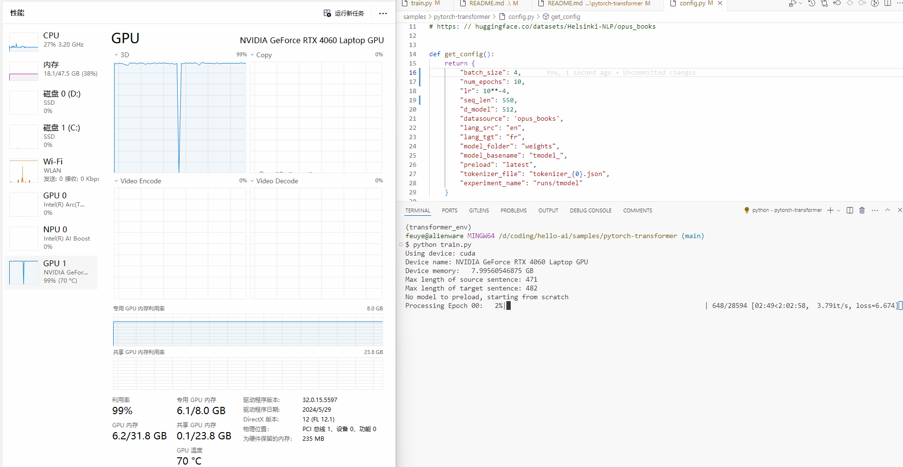

<!-- markdownlint-disable MD033 -->

# Attention is all you need implementation

YouTube video with full step-by-step implementation: <https://www.youtube.com/watch?v=ISNdQcPhsts>

Source code: <https://github.com/hkproj/pytorch-transformer>

## 1 Install

### venv

```sh
python -m venv transformer_env
# windows
.\transformer_env\Scripts\activate
python.exe -m pip install --upgrade pip
# macos
source transformer_env/bin/activate
pip install --upgrade pip
```

<https://pytorch.org/get-started/locally/>

### wheel

```sh
# macos
pip install torch torchvision torchaudio
pip install torchtext datasets tokenizers torchmetrics tensorboard altair wandb numpy==1.26.4
# windows
pip install torch torchvision torchaudio --index-url https://download.pytorch.org/whl/cu124
pip install torchtext datasets tokenizers torchmetrics tensorboard altair wandb numpy==1.26.4
```

## 2 Demo

```sh
# windows powershell
.\transformer_env\Scripts\activate
# windows git bash
source transformer_env/Scripts/activate
# macos
source transformer_env/bin/activate
```

```sh
python train.py
```



```sh
$ nvidia-smi -l 5

Fri Aug 23 00:09:15 2024
+-----------------------------------------------------------------------------------------+
| NVIDIA-SMI 555.97                 Driver Version: 555.97         CUDA Version: 12.5     |
|-----------------------------------------+------------------------+----------------------+
| GPU  Name                  Driver-Model | Bus-Id          Disp.A | Volatile Uncorr. ECC |
| Fan  Temp   Perf          Pwr:Usage/Cap |           Memory-Usage | GPU-Util  Compute M. |
|                                         |                        |               MIG M. |
|=========================================+========================+======================|
|   0  NVIDIA GeForce RTX 4060 ...  WDDM  |   00000000:01:00.0 Off |                  N/A |
| N/A   74C    P0            100W /  134W |    5896MiB /   8188MiB |     97%      Default |
|                                         |                        |                  N/A |
+-----------------------------------------+------------------------+----------------------+

```

<https://pypi.org/project/tqdm/>

PyTorch进度条库 **tqdm** (read taqadum, تقدّم) means “progress” in arabic. Instantly make your loops show a progress meter - just wrap any iterable with “tqdm(iterable)”, and you’re done!

"it/s" 代表 "iterations per second"，即每秒完成的迭代次数

```sh
python translate.py "Today is Friday, I feel good."

```

### 2.1 Introduction


#### 1 Input Embeddings


```python
self.embedding = nn.Embedding(vocab_size, d_model)
...
self.embedding(x) * math.sqrt(self.d_model)
```

#### 2 Positional Encodings


$$
PE(pos, 2i) = \sin{\frac{pos}{10000^{\frac{2i}{d_{model}}}}} \\
PE(pos, 2i+1) = \cos{\frac{pos}{10000^{\frac{2i}{d_{model}}}}}
$$

```python
pe = torch.zeros(seq_len, d_model)
pos = torch.arange(0, seq_len, dtype=torch.float).unsqueeze(1)
div_term = torch.exp(torch.arange(0, d_model, 2).float() * (-math.log(10000.0) / d_model))
pe[:, 0::2] = torch.sin(pos * div_term)
pe[:, 1::2] = torch.cos(pos * div_term)
pe = pe.unsqueeze(0)
self.register_buffer('pe', pe)
...
x = x + (self.pe[:, :x.shape[1], :]).requires_grad_(False)
return self.dropout(x)
```

#### 3 Layer Normalization


$$
\hat{x}_j=\frac{x_j-\mu_j}{\sqrt{\sigma^2_j+\epsilon}}
$$

```python
self.alpha = nn.Parameter(torch.ones(features))
self.bias = nn.Parameter(torch.zeros(features))
...
# 均值
mean = x.mean(dim=-1, keepdim=True)
# 标准差(均方差)
std = x.std(dim=-1, keepdim=True)
return self.alpha * (x - mean) / (std + self.eps) + self.bias
```

#### 4 Feed Forward

**d model** 512 [outer ] -- [inner] **d ff** 2048
$$
FFN(x)=max(0,xW_1+b_1)W_2+b_2
$$

$$
relu=max(0,x)
$$

```python
# 两个线性变换层
self.linear_1 = nn.Linear(d_model, d_ff)
self.linear_2 = nn.Linear(d_ff, d_model)
...
# 非线性激活函数
relu = torch.relu(self.linear_1(x))
return self.linear_2(self.dropout(relu))
```

#### 5 Multi-Head Attention


```python
def attention(query, key, value, mask, dropout: nn.Dropout):
    d_k = query.shape[-1]
    attention_scores = (query @ key.transpose(-2, -1)) / math.sqrt(d_k)
    if mask is not None:
        attention_scores.masked_fill_(mask == 0, -1e9)
    attention_scores = attention_scores.softmax(dim=-1)
    if dropout is not None:
        attention_scores = dropout(attention_scores)
    return (attention_scores @ value), attention_scores
```

#### 6 Residual Connection

```python
self.norm = LayerNormalization(features)
...
return x + self.dropout(sublayer(self.norm(x)))
```

#### 7 Encoder

```python
self_attention_block: MultiHeadAttentionBlock
feed_forward_block: FeedForwardBlock
...
x = self.residual_connections[0](
    x,
    lambda x: self.self_attention_block(x, x, x, src_mask)
)
x = self.residual_connections[1](
    x,
    self.feed_forward_block
)
return x
```

```python
layers: nn.ModuleList) -> None:
self.norm = LayerNormalization(features)
...
for layer in self.layers:
    x = layer(x, mask)
return self.norm(x)
```

#### 8 Decoder

```python
self_attention_block: MultiHeadAttentionBlock
cross_attention_block: MultiHeadAttentionBlock
feed_forward_block: FeedForwardBlock
...
x = self.residual_connections[0](
    x,
    lambda x: self.self_attention_block(x, x, x, tgt_mask)
)
x = self.residual_connections[1](
    x,
    lambda x: self.cross_attention_block(
        x,
        encoder_output,
        encoder_output,
        src_mask
    )
)
x = self.residual_connections[2](
    x,
    self.feed_forward_block
)
return x
```

```python
layers: nn.ModuleList) -> None:
self.norm = LayerNormalization(features)
...
for layer in self.layers:
    x = layer(x, encoder_output, src_mask, tgt_mask)
return self.norm(x)
```

#### 9 Linear Layer

convert the embedding into a position of the vocabulary

```python
self.proj = nn.Linear(d_model, vocab_size)
...
return self.proj(x)
```

#### 10 Transformer

```python
def build_transformer(
    src_vocab_size: int,
    tgt_vocab_size: int,
    src_seq_len: int,
    tgt_seq_len: int,
    d_model: int = 512,
    N: int = 6,
    h: int = 8,
    dropout: float = 0.1,
    d_ff: int = 2048
) -> Transformer
```

### 2.2 Task overview

#### 1 Tokenizer

```python
tokenizer_path = Path(config['tokenizer_file'].format(lang))
tokenizer = Tokenizer.from_file(str(tokenizer_path))
```

#### 2 Dataset

<https://huggingface.co/datasets/opus_books>

<https://huggingface.co/docs/tokenizers/quicktour>

wandb <https://wandb.ai>

```python
tokenizer_src = get_or_build_tokenizer(config, ds_raw, config['lang_src'])
tokenizer_tgt = get_or_build_tokenizer(config, ds_raw, config['lang_tgt'])

train_dataloader = DataLoader(
    # BilingualDataset dataset.py
    train_ds,
    batch_size=config['batch_size'],
    shuffle=True
)
val_dataloader = DataLoader(
    val_ds,
    batch_size=1,
    shuffle=True
)
```

#### 3 Training loop

```python
model = build_transformer(
    vocab_src_len,
    vocab_tgt_len,
    config["seq_len"],
    config['seq_len'],
    d_model=config['d_model']
)
return model
```

#### 4 Validation loop

```sh
run_validation
```

- `samples\pytorch-transformer\translate.py`
- `samples\pytorch-transformer\Inference.ipynb`

#### 5 Attention visualization

`samples\pytorch-transformer\attention_visual.ipynb`

```sh

```

**fin**

https://github.com/feuyeux
